# Jupyter Notebooks

These Jupyter notebooks are the foundation of our analysis. To expedite analysis, minimise the amount of redundancy, and streamline things, we've created a library, `cf_analysis_lib` which includes the most common imports (e.g. pandas, seaborn, sci-kits, and several stats packages). This library also exposes several methods for loading the data cleanly, which
means that in each notebook we don't need to load and reshape the data.

## Figure List

These notebooks are for obviously exploring and analysing the data, but they are also key to making the figures for our paper.

Thumbnail | Figure Number | Notebook
--- | --- | ---
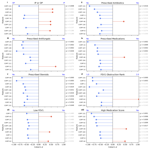 | 1a | [Medications Score and Health Metrics](HealthPCA.ipynb)
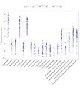 | 1b | [Medications Score and Health Metrics](HealthPCA.ipynb)
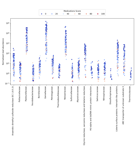 | 1c | [Medications Score and Health Metrics](HealthPCA.ipynb)
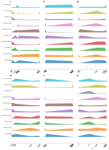 | 2a | [Every Person Is Different](EveryPerson.ipynb)
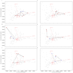 | 2b | [Every Person Is Different](EveryPerson.ipynb)
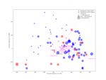 | 2c | [The abundance of Pseudomonas](Pseudomonas_PCA.ipynb)
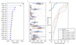   | 3  | [Pseudomonas](Pseudomonas_predictions.ipynb)
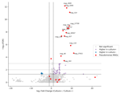   | 4  | [Pseudomonas](Pseudomonas_predictions.ipynb)
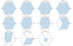   | 5  | [WorldWide CF Machine learning data](WorldWideML.ipynb)
 | 6  | This figure was created by an artist.
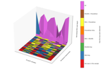 | S1 | [MGI vs Nanopore](MGI_Promethion_Minion.ipynb)
 | S2 | [MAG Metadata](MAG_Metadata.ipynb)
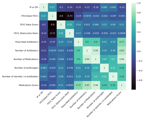 | S3 | [Medications Score and Health Metrics](HealthPCA.ipynb)
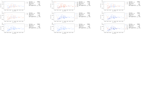 | S4 | [PCoA of the CPAF coloured by health measure](HealthPCA.ipynb)
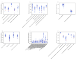 | S5 | [Medications Score and Health Metrics](HealthPCA.ipynb)
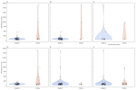 | S6 | [NTM culture status](Mycobacteria.ipynb)
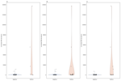 | S7 | [Stenotrophomonas culturing](Stenotrophomonas.ipynb)
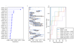 | S8 | [ABPA classification](ABPA.ipynb)
